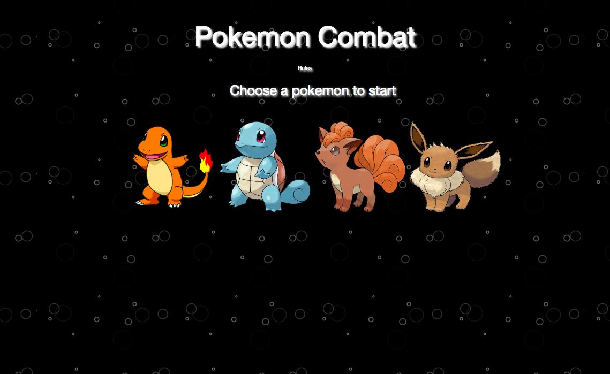

# Pokemon-Combat-Game

<!-- Put a description of what the project is -->
Learning jQuery: Click event handlers, binding/unbinding of event handlers, dymanically creating html elements and assigning attributes to them

## Link to deployed site
<!-- make a link to the deployed site --> 
<!-- [What the user will see](the link to the deployed site) -->
[pokemon-combat-game](https://ajitas.github.io/Pokemon-Combat-Game/)

## Images
<!-- take a picture of the image and add it into the readme  -->
<!--  -->


## technology used
<!-- make a list of technology used -->
<!-- what you used for this web app, like html css -->

<!-- 
1. First ordered list item
2. Another item
⋅⋅* Unordered sub-list. 
1. Actual numbers don't matter, just that it's a number
⋅⋅1. Ordered sub-list
4. And another item. 
-->
1. HTML
2. CSS/BootStrap
3. Javascript
    * control structure(loops, conditions, switch)
    * data structures
    * functions
4. jQuery
    * Event Handling
    * Binding/Unbinding events
    * Dynamically creating new html elements
    * Appending and removing dynamically created html elements to other html elements
    * Providing attributes to dynamically created html elements
    * Displaying/Hiding elements with show()/hide()


## code snippets
<!-- put snippets of code inside ``` ``` so it will look like code -->
<!-- if you want to put blockquotes use a > -->

```

//calculates the health points after each attack
var attack = function(){

    //decrease the health points after each attack
    yourHP = yourHP - enemyCounterAttack;
    enemyHP = enemyHP - yourBaseAttack * counter;
    //update the new health points on screen
    $("#your-hp").text(yourHP);
    $("#enemy-hp").text(enemyHP);
    $("#your-attack-hp").text(yourBaseAttack*counter);
    $("#enemy-attack-hp").text(enemyCounterAttack);
    //increase your attack power by your base attack power each time
    counter++;
    //if your health points go below 0 you lose the game
    if(yourHP <=0){
        youLost();
    }
    //if enemy's health points go below zero, you win the cuttent battle
    else if(enemyHP <=0){
        youWon();
    }
};

$( document ).ready(function() {
    //reset the game
    resetGame();

}).on("click","#pokemon1",function(){

    //assign health point and base attack power of your selected player pokemon
    yourHP = pokemon1HP;
    yourBaseAttack = pokemon1BaseAttack;
    var enemies=[$("#pokemon2"),$("#pokemon3"),$("#pokemon4")];
    //move the rest of the pokemons to enemy area
    moveEnemiesToEnemyArea(enemies,$(this));
    
}).on("click",".enemies",function(){
    //move the selected enemy to defender area
    moveDefenderToDefenderArea($(this));

}).on("click","#start-combat",function(){

    //create a new img tag for combat area
    //your selected pokemon
    var localYourPokemon = $("");
    localYourPokemon.attr("src",yourPokemon.attr("src"));
    localYourPokemon.attr("class","combat-pokemon");

    //create a new img tag for combat area
    //your selected defender pokemon
    var localYourEnemy = $("");
    localYourEnemy.attr("src",yourEnemy.attr("src"));
    localYourEnemy.attr("class","combat-pokemon");

    //append the newly created image tags to the combat-area
    $("#your-pokemon").append(localYourPokemon);
    $("#enemy-pokemon").append(localYourEnemy);

    //sets the scoreboard
    $("#your-hp").text(yourHP);
    $("#enemy-hp").text(enemyHP);
    $("#your-attack-hp").text("0");
    $("#enemy-attack-hp").text("0");

})
```
## Learning points
* Event Handling in jQuery
* Binding/Unbinding events in jQuery
* Dynamically creating new html elements using jQuery
* Appending and removing dynamically created html elements to other html elements using jQuery
* Providing attributes to dynamically created html elements using jQuery
* Displaying/Hiding elements with show()/hide() jQuery


## Author 
[Ajita Srivastava](https://github.com/ajitas)

## License
Standard MIT License